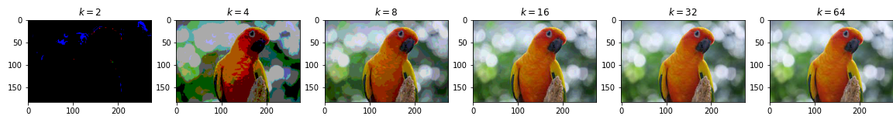

# MyLearnings

## [Image Representation](ImageRepresentation/) 

###### -21 July 2021

A short [presentation](https://docs.google.com/presentation/d/1kzJEU7_srjKiPLY6j2tQNkGtcu9sl_nWIh5s_eP30dg/edit?usp=sharing) on Image sampling and quantization

## [Image Morphology](ImageMorphology/) 

###### -30 July 2021

A short [document](https://camera-ai.quip.com/H6J3AntWYuMN/Morphological-Operations) on Morphological operations on Images

## [Style Transfer](StyleTransfer/) 

###### -16 Aug 2021
Brief introduction to [style transfer](https://camera-ai.quip.com/eeE3A1TVBNaR/Style-Transfer) and recent advancements in the field

## [FastAPI](FastAPI/) 

###### -31 Aug 2021
A beginners guide to FastAPI using Spacy NLP library. One of the fastest python web frameworks and definitely the easiest one to use (awesome for data science 😉)
